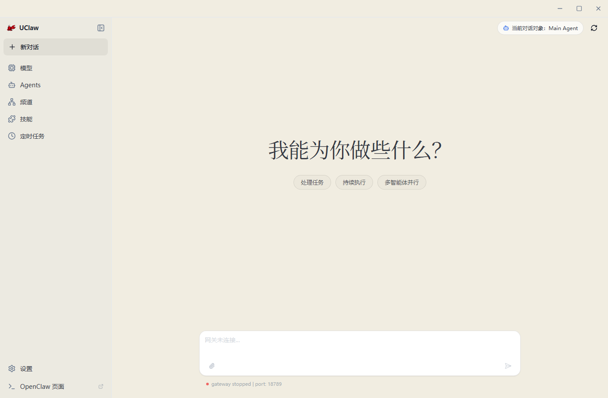
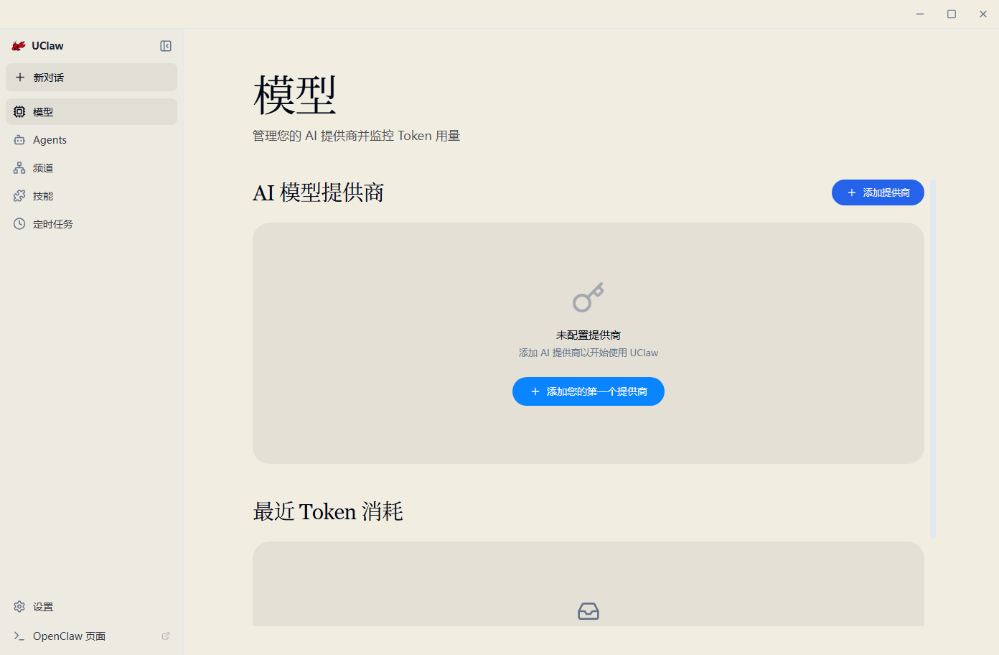
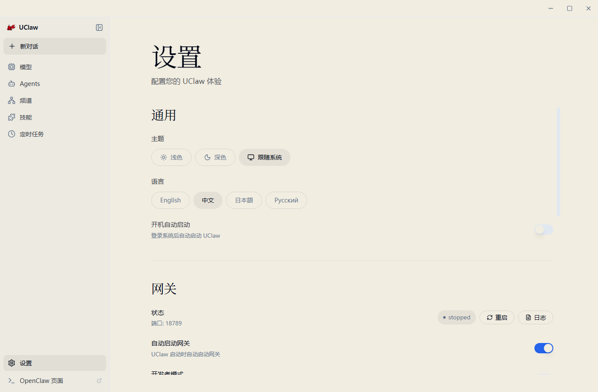
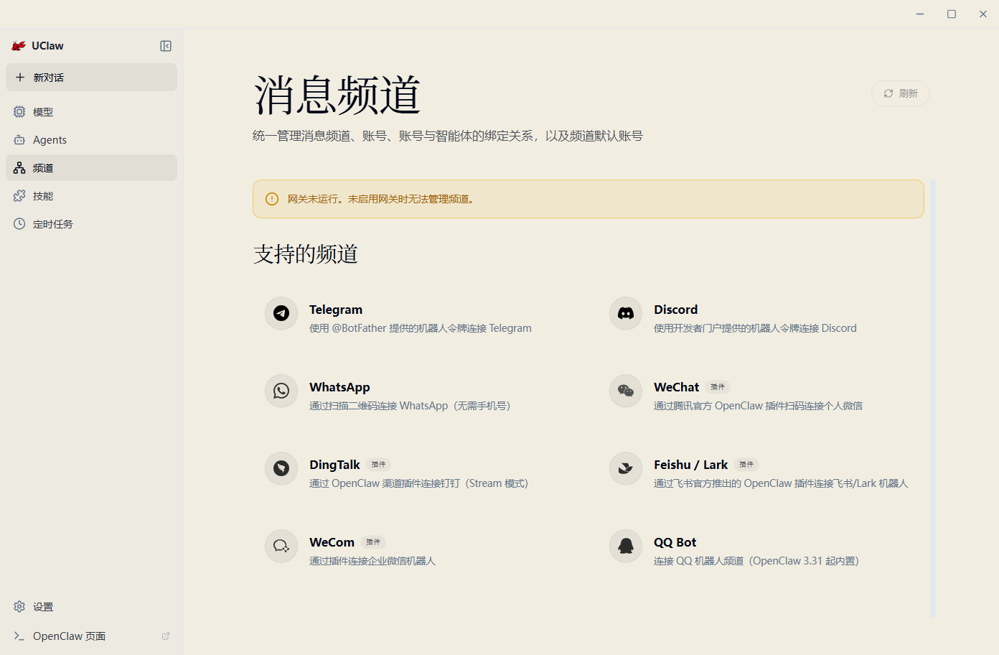
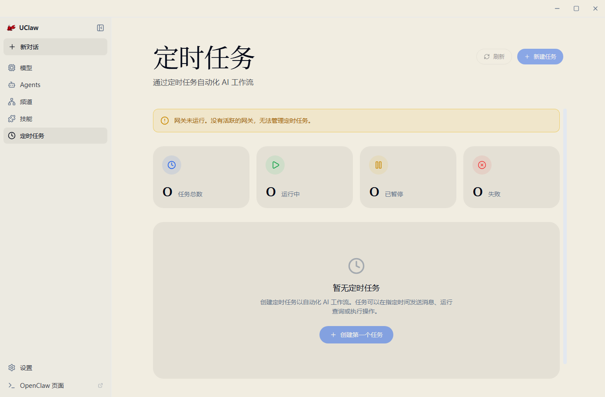
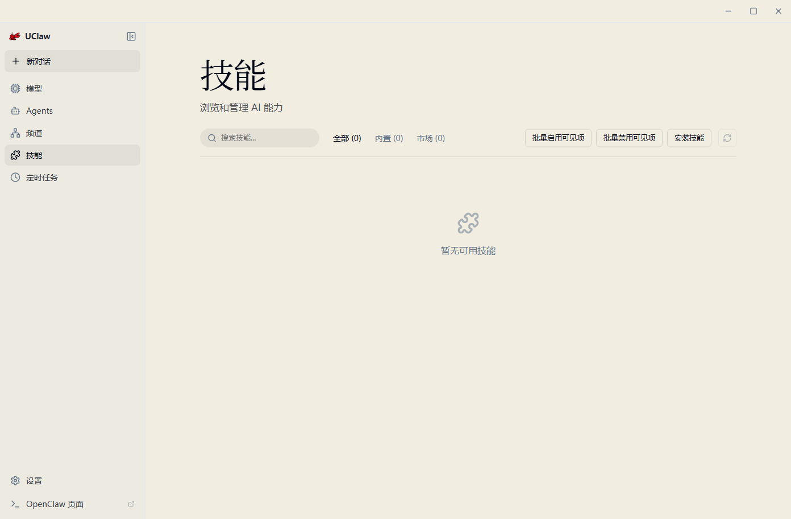

# UClaw 使用指南

适用版本：UClaw v0.3.2 及相近版本
适用系统：Windows、macOS、Linux
更新日期：2026-05-17

这份文档面向普通用户，说明如何安装、首次打开、开始对话、查看模型与联网搜索状态、使用频道和定时任务。它不要求你了解源码、命令行或 OpenClaw 内部配置。

网页版本见 [docs/user-manual.html](docs/user-manual.html)。

## 1. UClaw 是什么

UClaw 是一个桌面端 AI 助手应用。你可以把它理解成一个本地聊天工作台：它负责显示聊天界面、管理工作区、保存使用配置，并连接我们远程部署的 AI API、联网搜索能力、工具和插件。

UClaw 不是单纯网页，也不是要求你自己部署后端服务的开发工具。普通用户通常只需要按界面完成一键配置或一键切换，就可以使用 AI 对话和联网搜索。



## 2. 安装和首次打开

从 [GitHub Releases](https://github.com/DepartureZSH/UClaw/releases) 下载对应系统的安装包或压缩包。

Windows：
- 安装版通常下载 `win-x64.exe` 并按安装向导完成。
- 移动盘版优先下载压缩包，解压到移动盘后使用包内启动器或 `UClaw.exe`。
- 如果 Windows 提示未知发布者，需要确认文件来源可信后再继续。

macOS：
- 下载对应 macOS 包，建议把 `.app` 放到“应用程序”或 APFS 分区。
- 如果系统提示来自互联网或无法验证开发者，请在系统设置的安全性选项中允许打开。
- 数据和工作区可以放在移动盘，但不建议直接从 ExFAT 分区运行 `.app`。

Linux：
- 下载 Linux 包后解压。
- 如果文件无法启动，先给启动脚本或 AppImage 添加执行权限。
- 移动盘使用时，尽量保持挂载路径稳定。

第一次启动时，UClaw 会先进入启动加载页：

1. 自动检查本地数据目录和随盘工作台。
2. 自动同步公司下发的 New API 与联网搜索配置。
3. 自动启动 Gateway。
4. 进入主界面对话。

Windows 移动盘 ZIP 版本会固定使用程序旁边的 `data/` 和 `data/workspace`，普通用户不需要选择工作目录。如果出现“填写公司密钥”页面，请输入运维提供的公司密钥并点击“保存并同步配置”。普通用户不需要填写 API 地址或 API Key。旧 `/setup` 入口会打开公司密钥页面，仅用于制作人员初始化或重新绑定随盘工作台。

## 3. 主要页面截图和用途

| 页面 | 截图 | 用途 |
|------|------|------|
| 对话 |  | 提问、继续会话、让 AI 联网搜索、查看当前 Gateway 状态 |
| 模型 |  | 查看模型用量、刷新模型列表、检查 New API 和 web-search 配置 |
| 设置 |  | 修改语言、主题、代理、更新、网关和日志设置 |
| 频道 |  | 连接微信、飞书、钉钉等外部消息通道，并绑定 Agent |
| 定时任务 |  | 创建日报、定时搜索、周期提醒和外部投递 |
| 技能 |  | 查看已安装技能、启用状态、来源位置和技能配置 |

## 4. 页面字段速查

| 页面 | 主要字段和按钮 | 普通用户常用操作 |
|------|----------------|------------------|
| 对话 | 新对话、会话列表、当前对话对象、刷新、输入框、附件、发送/停止、Gateway 状态 | 输入问题后发送；需要最新信息时明确要求“联网搜索并附来源”；发送按钮变成停止时表示 AI 正在回复 |
| 模型 | AI 模型提供商、模型 ID、获取模型列表、API 密钥状态、替换 API Key、联网搜索 web-search、搜索模型检测 | 确认 New API 已配置，刷新可用模型列表，确认 Kimi/Moonshot 搜索模型可用 |
| 设置 | 主题、语言、开机自启、网关状态、端口、日志、代理服务器、绕过规则、更新、关于 | 调整外观语言，检查更新，打开日志文件夹，配置本地代理 |
| 频道 | 添加频道、账号 ID、默认账号、绑定 Agent、连接状态、诊断、复制诊断、重启网关 | 连接外部消息入口，并指定由哪个 Agent 回复 |
| 定时任务 | 任务名称、触发时间、提示词、执行 Agent、发送账号、接收目标、启用状态 | 创建日报、定时总结、定期搜索或外部消息投递 |
| 技能 | 技能名称、启用状态、来源位置、配置/API Key、打开目录 | 查看内置技能是否启用，按需要打开技能目录或填写技能配置 |

## 5. 模型和联网搜索

UClaw 当前面向普通用户的模型服务是 New API。它由我们远程部署并维护，提供 AI API 和联网搜索能力的一键配置、一键切换。普通用户不需要自行部署 New API，也不需要手动编辑 `openclaw.json`。

在模型页中：

- “AI 模型提供商”区域显示 New API 配置、当前模型 ID、API 密钥状态和“获取模型列表”按钮。
- “联网搜索 web-search”区域位于 AI 模型提供商下方，用于查看搜索模型、检测搜索配置，并从 New API 可用模型中选择 Kimi/Moonshot 搜索模型。
- 如果模型列表为空，先确认网络可用，再重新点击“获取模型列表”或重新执行一键配置。
- 如果普通对话可用但联网搜索失败，先检查 web-search 区域是否显示已配置，再尝试重新检测或重启 UClaw。

可以这样提问：

```text
请联网搜索今天的重点新闻，并附上来源。
```

```text
搜索后总结这个软件最近发布了哪些更新，不要只凭记忆回答。
```

## 6. 频道配置细节

UClaw 的频道页支持多账号。手动填写账号 ID 时只能使用小写字母、数字、下划线和短横线，最长 64 位，并且必须以字母或数字开头。

| 频道 | 连接方式 | 需要填写的字段 | 说明 |
|------|----------|----------------|------|
| 微信 WeChat | 扫码 | 不需要手写字段 | 点击生成二维码，用手机微信扫码并确认 |
| WhatsApp | 扫码 | 不需要手写字段 | 在手机 WhatsApp 的已关联设备中扫码 |
| Telegram | Bot Token | 机器人令牌、允许的用户 ID | 令牌来自 @BotFather；用户 ID 用于限制使用者 |
| Discord | Bot Token | 机器人令牌、服务器 ID、频道 ID（可选） | 频道 ID 可限制机器人只在指定频道工作 |
| 飞书 Feishu / Lark | 应用凭证 | 应用 ID、应用密钥 | 从飞书开放平台企业自建应用中获取 |
| 钉钉 DingTalk | 应用凭证 | Client ID / AppKey、Client Secret / AppSecret | 适用于钉钉 Stream 模式 |
| 企业微信 WeCom | 应用凭证 | 机器人 Bot ID、应用 Secret | 从企业微信管理后台或机器人配置中获取 |
| QQ Bot | 应用凭证 | App ID、Client Secret | 从 QQ 机器人开放平台获取 |

频道保存后，UClaw 可能会提示重启 Gateway。按提示重启即可。连接成功后，可以在频道页把账号绑定到某个 Agent；之后外部消息会交给对应 Agent 处理。

## 7. 设置页常用项

通用：
- 主题：浅色、深色或跟随系统。
- 语言：切换界面语言。
- 开机自动启动：系统登录后自动打开 UClaw。

网关：
- 状态：查看 Gateway 是否已连接。
- 端口：默认本地端口。
- 日志：打开应用日志文件夹。
- 代理服务器：如公司网、校园网需要代理，可填写 `http://127.0.0.1:7890` 这类本地代理地址。
- 绕过规则：不走代理的主机，支持用分号、逗号或换行分隔。

更新：
- 检查更新：手动检查 GitHub Release 中的新版本。
- 自动检查更新：启动时自动查看是否有新版本。
- ZIP 便携版：应用内会提示手动更新，请从 GitHub Releases 下载新版 ZIP，退出 UClaw 后替换程序文件；内置 OpenClaw 会随 UClaw 一起更新。
- 安装器版本：如果未来提供安装器更新包，可使用应用内下载与安装。

关于：
- 查看当前版本、项目主页和常见问题入口。

## 8. 移动盘和跨系统使用

移动盘使用的核心原则是：用包内启动器打开应用，让数据目录和工作区都跟着移动盘走。

推荐做法：

- Windows：解压移动盘包到 U 盘或移动硬盘，优先使用包内启动器或 `UClaw.exe`。
- macOS：应用放 APFS 分区或本机应用目录，数据和工作区放共享分区；优先使用 `Launch UClaw.command`。
- Linux：解压后运行包内启动脚本；如果无法启动，先添加执行权限。

不要在拷贝未完成、移动盘正在同步或系统还在扫描文件时立即启动。慢速 U 盘会明显拖慢首次运行、解压和更新。

## 9. 常见问题

为什么打开后要求填写公司密钥？

常见原因是随包配置凭证缺失、过期，或者公司配置服务要求重新授权。请输入运维提供的公司密钥；如果仍失败，请检查网络后联系运维。

为什么模型列表为空？

先确认 New API 一键配置是否完成，再检查网络是否能访问远程服务。之后回到模型页点击“获取模型列表”。

为什么普通对话可以，联网搜索失败？

先确认 web-search 区域显示已配置，并重新检测搜索模型。如果仍失败，重启 UClaw 后再试；必要时打开日志并反馈错误信息。

为什么 Gateway 启动慢？

首次启动会准备本地运行环境并检查组件。慢速移动盘、老电脑或安全软件扫描都可能拖慢启动。

为什么更新很慢？

Windows 压缩包和运行时包含较多小文件。慢速 U 盘写入小文件会非常慢，建议先在本机 SSD 解压新版 ZIP，再整体复制到移动盘，或使用速度更好的 U 盘/移动 SSD。

遇到启动或运行错误时，点击“复制诊断信息”会生成脱敏诊断包。诊断包包含版本、平台、数据目录、启动阶段、Gateway/频道状态和最近日志摘要，不包含 API Key、公司密钥、token、cookie 或 OAuth 凭据。

## 10. 安全建议

- 不要公开服务配置、访问凭证或包含敏感信息的设置页面截图。
- 移动盘丢失时，工作区里的配置和聊天记录也可能泄露，建议重要设备开启磁盘加密。
- 不要把不可信来源的文件直接放进工作区。
- 联网搜索得到的信息要看来源。重要决策不要只听 AI 总结，最好打开来源页面核对原文、日期和上下文。
